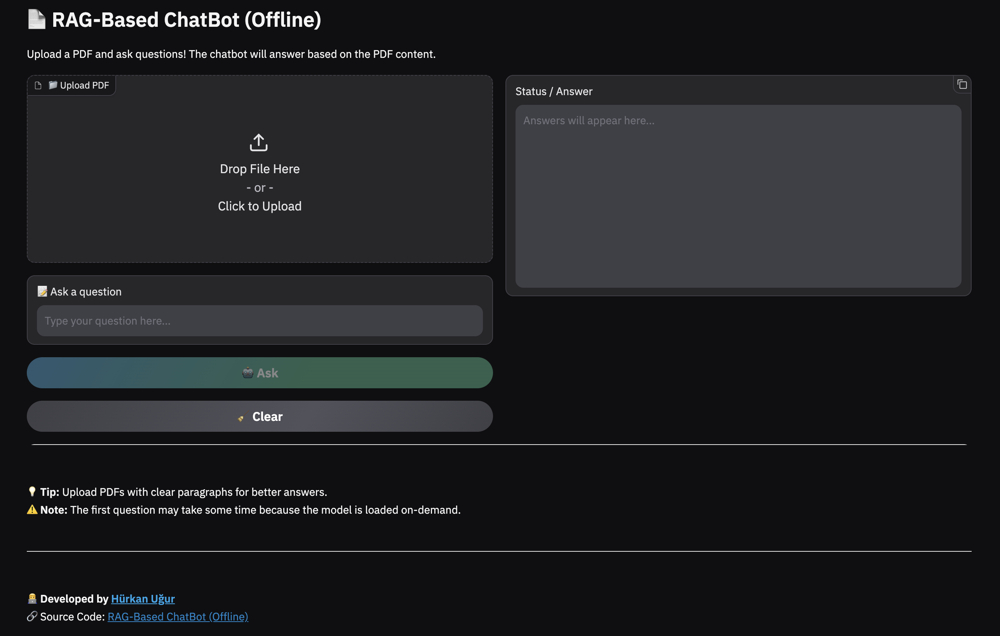
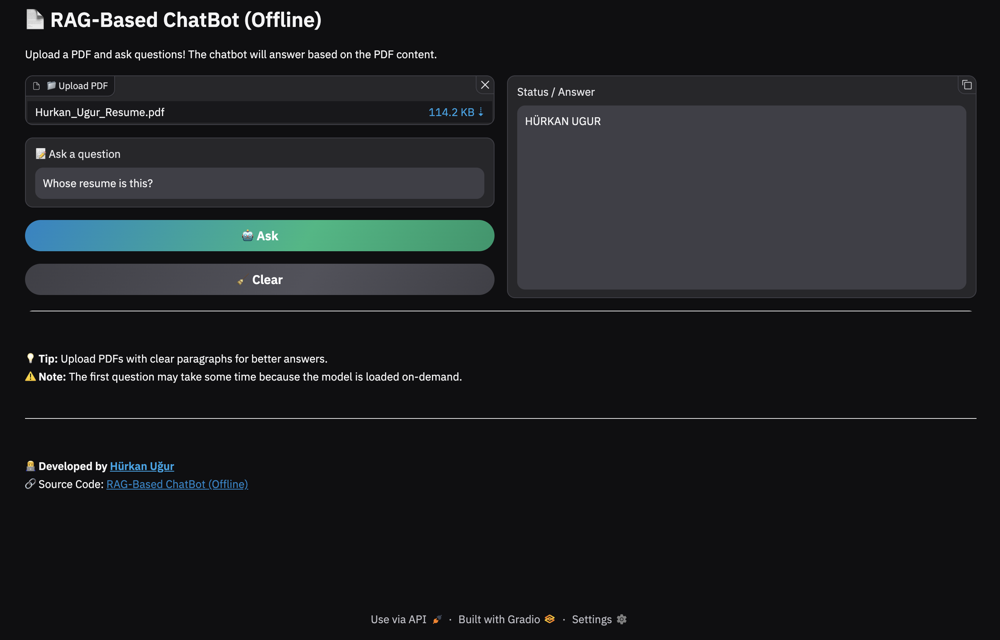

# 🧠 RAG-Based ChatBot (Offline)

## 📖 Overview
This project implements a **Retrieval-Augmented Generation (RAG) chatbot** that answers questions based on **user-provided PDF documents**.  

- 📄 **Dynamic knowledge base** — user uploads PDFs which are split into paragraphs  
- ⚙️ **Embeddings using Sentence Transformers** — converts text into vectors  
- 🧱 **FAISS-based retrieval** — efficiently finds the most relevant paragraphs  
- 🤖 **Text generation using Flan-T5** — generates answers using retrieved context  
- 💻 **Local inference** — runs on **CPU, Apple MPS, or NVIDIA CUDA GPU**  
- 🖥️ **Gradio UI** — web interface for uploading PDFs and asking questions  
- 🛠️ **Lazy model loading** — model loads only on first query for faster startup  

---

## 🖼️ Application Screenshot

Below is a preview of the **Gradio Interface** used for real-time classification:



---

## 🧩 Libraries
- **PyTorch** – model and inference  
- **Transformers** – Flan-T5 text generation  
- **sentence-transformers** – embeddings  
- **faiss** – vector retrieval  
- **numpy** – numerical operations  
- **PyPDF2** – PDF parsing  
- **gradio** – UI interface

---

## ⚙️ Requirements

- Python **3.13+**
- Recommended editor: **VS Code**

---

## 📦 Installation

- Clone the repository
```bash
git clone https://github.com/hurkanugur/RAG-Based-ChatBot.git
```

- Navigate to the `RAG-Based-ChatBot` directory
```bash
cd RAG-Based-ChatBot
```

- Install dependencies
```bash
pip install -r requirements.txt
```

---

## 🔧 Setup Python Environment in VS Code

1. `View → Command Palette → Python: Create Environment`  
2. Choose **Venv** and your **Python version**  
3. Select **requirements.txt** to install dependencies  
4. Click **OK**

---

## 📂 Project Structure

```bash
assets/
└── app_screenshot.png            # Application screenshot

src/
├── config.py                     # Paths, model settings...
├── device_manager.py             # Selects and manages compute device
├── embeddings.py                 # Local embedding model
├── retriever.py                  # FAISS-based retrieval
├── generator.py                  # Text generation model
├── pdf_loader.py                 # PDF parsing
└── ui.py                         # Gradio UI

main/
└── main.py                       # Entry point for chatbot

requirements.txt                  # Python dependencies
```

---

## 📂 System Architecture

```bash
User PDF Upload
    ↓
PDF Loader (split into paragraphs)
    ↓
Sentence Transformer Embeddings
    ↓
FAISS Retriever (top-k relevant paragraphs)
    ↓
Flan-T5 Generator (with retrieved context)
    ↓
Answer displayed in Gradio UI
```

---

## 📂 Run the Application
Navigate to the project directory:
```bash
cd RAG-Based-ChatBot
```

Run the app:
```bash
python -m main.main
```
or
```bash
python3 -m main.main
```
